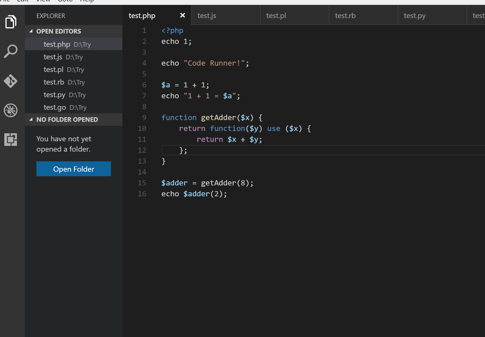
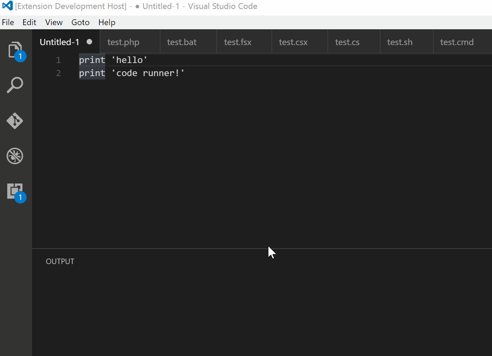

# Code Runner

[](https://gitter.im/formulahendry/vscode-code-runner?utm_source=badge&utm_medium=badge&utm_campaign=pr-badge&utm_content=badge)   [](https://github.com/formulahendry/vscode-code-runner/actions/workflows/main.yml)

Run code snippet or code file for multiple languages: **C, C++, Java, JavaScript, PHP, Python, Perl, Perl 6, Ruby, Go, Lua, Groovy, PowerShell, BAT/CMD, BASH/SH, F# Script, F# (.NET Core), C# Script, C# (.NET Core), VBScript, TypeScript, CoffeeScript, Scala, Swift, Julia, Crystal, OCaml Script, R, AppleScript, Elixir, Visual Basic .NET, Clojure, Haxe, Objective-C, Rust, Racket, Scheme, AutoHotkey, AutoIt, Kotlin, Dart, Free Pascal, Haskell, Nim, D, Lisp, Kit, V, SCSS, Sass, CUDA, Less, Fortran, Ring, Standard ML, Zig, Mojo, Erlang, SPWN, Pkl, Gleam**, and custom command

## Book for VS Code

[《Visual Studio Code 权威指南》](https://union-click.jd.com/jdc?e=jdext-1261348777639735296-0&p=AyIGZRhbHQsWAVIaXxEyEgRdG1sRBxU3EUQDS10iXhBeGlcJDBkNXg9JHUlSSkkFSRwSBF0bWxEHFRgMXgdIMkRxFAUJD1RQZT0cBnwKDE4%2BaDpgB2ILWStbHAIQD1QaWxIBIgdUGlsRBxEEUxprJQIXNwd1g6O0yqLkB4%2B%2FjcePwitaJQIWD1cfWhwKGwVSG1wlAhoDZc31gdeauIyr%2FsOovNLYq46cqca50ytrJQEiXABPElAeEgRSG1kQCxQBUxxZHQQQA1YTXAkDIgdUGlscChECXRs1FGwSD1UbWRALFwRWK1slASJZOxoLRlUXU1NONU9QEkdXWRlJbBUDVB9TFgAVN1caWhcA)：带你深入浅出 VS Code！


## WeChat Official Account

VS Code 的热门文章、使用技巧、插件推荐、插件开发攻略等，请关注“**玩转VS Code**”公众号！


## Donation

If you like this extension, you could become a backer or sponsor via **[Patreon](https://www.patreon.com/junhan)**, donate via **[PayPal](https://www.paypal.me/junhanme)**, or scan below QR code to donate via **Alipay**. Any amount is welcome. It will encourage me to make this extension better and better!


## Features

* Run code file of current active Text Editor
* Run code file through context menu of file explorer
* Run selected code snippet in Text Editor
* Run code per Shebang
* Run code per filename glob
* Run custom command
* Stop code running
* View output in Output Window
* Set default language to run
* Select language to run
* Support REPL by running code in Integrated Terminal

## Usages

* To run code:
  * use shortcut `Ctrl+Alt+N`
  * or press `F1` and then select/type `Run Code`, 
  * or right click the Text Editor and then click `Run Code` in editor context menu
  * or click `Run Code` button in editor title menu
  * or click `Run Code` button in context menu of file explorer
* To stop the running code:
  * use shortcut `Ctrl+Alt+M`
  * or press `F1` and then select/type `Stop Code Run`
  * or click `Stop Code Run` button in editor title menu
  * or right click the Output Channel and then click `Stop Code Run` in context menu



* To select language to run, use shortcut `Ctrl+Alt+J`, or press `F1` and then select/type `Run By Language`, then type or select the language to run: e.g `php, javascript, bat, shellscript...`



* To run custom command, then use shortcut `Ctrl+Alt+K`, or press `F1` and then select/type `Run Custom Command`

## Configuration

Make sure the executor PATH of each language is set in the environment variable.
You could also add entry into `code-runner.executorMap` to set the executor PATH.
e.g. To set the executor PATH for ruby, php and html:
```json
{
    "code-runner.executorMap": {
        "javascript": "node",
        "php": "C:\\php\\php.exe",
        "python": "python",
        "perl": "perl",
        "ruby": "C:\\Ruby23-x64\\bin\\ruby.exe",
        "go": "go run",
        "html": "\"C:\\Program Files (x86)\\Google\\Chrome\\Application\\chrome.exe\"",
        "java": "cd $dir && javac $fileName && java $fileNameWithoutExt",
        "c": "cd $dir && gcc $fileName -o $fileNameWithoutExt && $dir$fileNameWithoutExt"
    }
}
```
**Supported customized parameters**
  * $workspaceRoot: The path of the folder opened in VS Code
  * $dir: The directory of the code file being run
  * $dirWithoutTrailingSlash: The directory of the code file being run without a trailing slash
  * $fullFileName: The full name of the code file being run
  * $fileName: The base name of the code file being run, that is the file without the directory
  * $fileNameWithoutExt: The base name of the code file being run without its extension
  * $driveLetter: The drive letter of the code file being run (Windows only)
  * $pythonPath: The path of Python interpreter (set by `Python: Select Interpreter` command)

**Please take care of the back slash and the space in file path of the executor**
  * Back slash: please use `\\`
  * If there ares spaces in file path, please use `\"` to surround your file path

You could set the executor per filename [glob](https://en.wikipedia.org/wiki/Glob_(programming)):
```json
{
    "code-runner.executorMapByGlob": {
        "pom.xml": "cd $dir && mvn clean package",
        "*.test.js": "tap",
        "*.js": "node"
    }
}
```

Besides, you could set the default language to run:
```json
{
    "code-runner.defaultLanguage": "javascript"
}
```
**For the default language:** It should be set with language id defined in [VS Code](https://github.com/Microsoft/vscode/tree/master/extensions). The languages you could set are `java, c, cpp, javascript, php, python, perl, ruby, go, lua, groovy, powershell, bat, shellscript, fsharp, csharp, vbscript, typescript, coffeescript, swift, r, clojure, haxe, objective-c, rust, racket, ahk, autoit, kotlin, dart, pascal, haskell, nim, d, lisp`

Also, you could set the executor per file extension:
```json
{
    "code-runner.executorMapByFileExtension": {
        ".vbs": "cscript //Nologo"
    }
}
```

To set the custom command to run:
```json
{
    "code-runner.customCommand": "echo Hello"
}
```

To set the the working directory:
```json
{
    "code-runner.cwd": "path/to/working/directory"
}
```

To set whether to clear previous output before each run (default is false):
```json
{
    "code-runner.clearPreviousOutput": false
}
```

To set whether to save all files before running (default is false):
```json
{
    "code-runner.saveAllFilesBeforeRun": false
}
```

To set whether to save the current file before running (default is false):
```json
{
    "code-runner.saveFileBeforeRun": false
}
```

To set whether to show extra execution message like [Running] ... and [Done] ... (default is true):
```json
{
    "code-runner.showExecutionMessage": true
}
```

**[REPL support]** To set whether to run code in Integrated Terminal (only support to run whole file in Integrated Terminal, neither untitled file nor code snippet) (default is false):
```json
{
    "code-runner.runInTerminal": false
}
```

To set whether to preserve focus on code editor after code run is triggered (default is true, the code editor will keep focus; when it is false, Terminal or Output Channel will take focus):
```json
{
    "code-runner.preserveFocus": true
}
```

`code-runner.ignoreSelection`: Whether to ignore selection to always run entire file. (Default is **false**)

`code-runner.showRunIconInEditorTitleMenu`: Whether to show 'Run Code' icon in editor title menu. (Default is **true**)

`code-runner.showRunCommandInEditorContextMenu`: Whether to show 'Run Code' command in editor context menu. (Default is **true**)

`code-runner.showRunCommandInExplorerContextMenu`: Whether to show 'Run Code' command in explorer context menu. (Default is **true**)

`code-runner.showStopIconInEditorTitleMenu`: Whether to show 'Stop Code Run' icon in editor title menu when code is running. (Default is **true**)

`code-runner.terminalRoot`: For Windows system, replaces the Windows style drive letter in the command with a Unix style root when using a custom shell as the terminal, like Bash or Cgywin. Example: Setting this to `/mnt/` will replace `C:\path` with `/mnt/c/path` (Default is **""**)

`code-runner.temporaryFileName`: Temporary file name used in running selected code snippet. When it is set as empty, the file name will be random. (Default is **"tempCodeRunnerFile"**)

`code-runner.respectShebang`: Whether to respect Shebang to run code. (Default is **true**)

## About CWD Setting (current working directory)
1. By default, use the `code-runner.cwd` setting
2. If `code-runner.cwd` is not set and `code-runner.fileDirectoryAsCwd` is `true`, use the directory of the file to be executed
3. If `code-runner.cwd` is not set and `code-runner.fileDirectoryAsCwd` is `false`, use the path of root folder that is open in VS Code
4. If no folder is open, use the os temp folder

## Note
* For Objective-C, it is only supported on macOS
* To run C# script, you need to install [scriptcs](http://scriptcs.net/)
* To run TypeScript, you need to install [ts-node](https://github.com/TypeStrong/ts-node)
* To run Clojure, you need to install [Leiningen](https://leiningen.org/) and [lein-exec](https://github.com/kumarshantanu/lein-exec)

## Telemetry data
By default, telemetry data collection is turned on to understand user behavior to improve this extension. To disable it, update the settings.json as below:
```json
{
    "code-runner.enableAppInsights": false
}
```

## Change Log
See Change Log [here](CHANGELOG.md)

## Issues
Submit the [issues](https://github.com/formulahendry/vscode-code-runner/issues) if you find any bug or have any suggestion.

## Contribution
Fork the [repo](https://github.com/formulahendry/vscode-code-runner) and submit pull requests.
